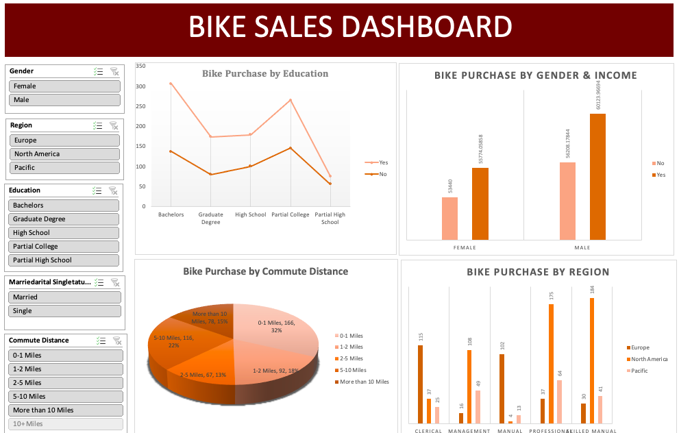

# 🚲 Bike Sales Dashboard – Excel

## 📊 Project Overview
This project analyzes customer and sales data for a bike retailer to uncover insights about purchasing behavior.  
Using **Microsoft Excel**, I cleaned and transformed raw data, built pivot tables, and designed an interactive dashboard that highlights customer demographics, sales trends, and purchasing patterns.  

---

## 🔧 Key Features
- ✅ Data cleaning and preparation using Excel formulas and formatting  
- ✅ Pivot tables to analyze relationships between **income, age, and purchase likelihood**  
- ✅ Interactive slicers and filters for dynamic analysis  
- ✅ Visualizations: bar charts, line charts, and pie charts  
- ✅ Insights on customer demographics most likely to purchase a bike  

---

## 🛠 Skills Demonstrated
- Data Cleaning (Excel formulas & formatting)  
- Data Analysis (Pivot Tables, Aggregations)  
- Data Visualization (Charts, Slicers, Dashboards)  
- Storytelling with Data  

---

## 💡 Key Insights
- Customers with **higher income** are more likely to purchase bikes  
- **Middle-aged customers (31–50 years)** show the strongest buying behavior  
- Interactive slicers allow filtering by **region, gender, and marital status** for deeper insights  

---

## 📂 Repository Contents
- `Bike_Sales_Dashboard.xlsx` → The full Excel dashboard  
- `Dashboard_Screenshot.png` → A preview of the dashboard  

---

## 🖼 Dashboard Preview

---
